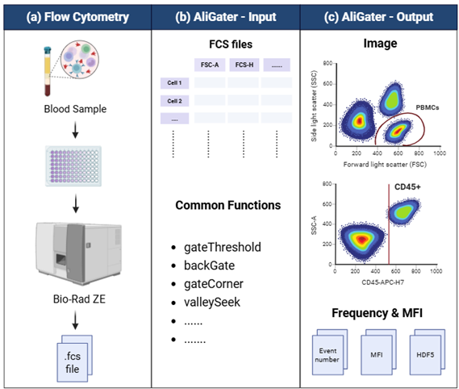
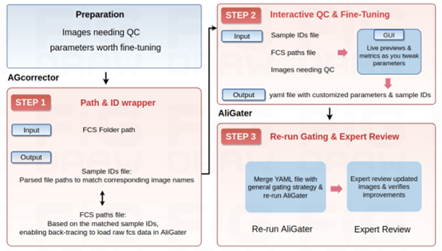
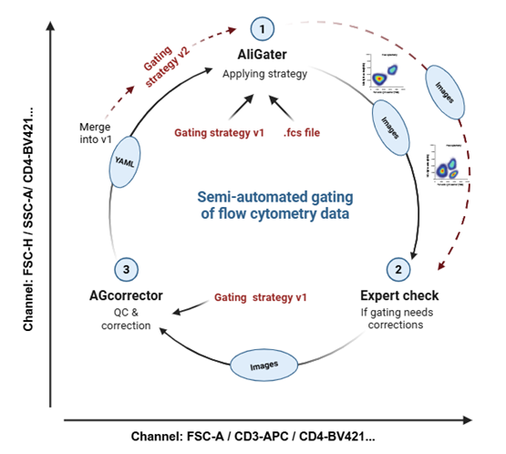

# Extending AliGater: Advancing Gating Strategies and Machine Learning for Flow Cytometry Analysis

**Research Project for the Master’s Programme in Bioinformatics, Lund University (2025)**

This repository documents the full scripts and progress of my research project, focusing on:
1. Using AliGater to gate cell population
2. Developing interactive gating correction via AGcorrector
3. Advancing Aligater with machine learning
4. Performing statistical analysis of blood-based immune phenotypes with clinical covariates

**All detailed steps, scripts, and Jupyter notebooks referenced here are included in the repository: https://github.com/WenxiaRen0751/BINP39.git**

# Installing AliGater
AliGater was used to classify and quantify immune-cell populations from flow cytometry data.
Installation instructions are available here: https://github.com/LudvigEk/aligater.git

# Cell Population Gating Using AliGater
The general workflow of AliGater is illustrated in Fig 1. After exporting .fcs files from the flow cytometer (Fig 1a), a small subset of representative samples is randomly selected to design and optimize the general gating strategy (Fig 1b). Appropriate gating algorithms are applied and validated on these samples to ensure accuracy and robustness. Once optimized, the gating strategy is applied in batch mode to all samples. AliGater produces flow cytometry images as one of its primary outputs (Fig 1c). For samples where visual inspection indicates the need for further refinement, the analysis can be re-run with adjusted gating parameters for specific samples. The final outputs, including gated population images, cell population frequencies, and median fluorescence intensities (MFI), are exported for downstream analyses (Fig 1c).

The final gating scripts for NK-monocyte-DC (B-panel for short) and T-Panel are  described in the files:

**“1_B_Panel_Previous/ ImmSight_B_Panel_Gating_Strategy_1006.py”**
Used to gate the B-panel flow cytometry data (.fcs) generated before 05/30/2025

**“2_B_Panel_Newdata/ ImmSight_B_Panel_Gating_Strategy_newdata.py”**
Used to gate the B-panel (.fcs) data generated after 05/30/2025

**“3_T_Panel_Previous/ ImmSight_T_Panel_Gating_Strategy.py”**
Used to gate the T-panel (.fcs) data generated before 05/30/2025

**“4_T_Panel_Newdata/ ImmSight_T_Panel_Gating_Strategy_newdata.py.py”**
Used to gate the T-panel (.fcs) data generated before 05/30/2025

# Interactive gating refinement with AGcorrector
AGcorrector is a Streamlit-based web application developed to provide interactive quality control and refinement of AliGater gating parameters (Fig 2). It allows manual adjustment of gating thresholds and automatically updates configuration files for reprocessing.

1. Preparation phase

    Identify samples requiring QC.

    Define tunable parameter ranges for refinement.

2. QC & Fine-Tuning phase

    AGcorrector uses sample IDs and file paths to trace back to the raw FCS data.

    Experts interactively adjust parameters.

    A YAML file containing sample-specific parameter overrides is generated.

3. Re-run phase

    Refined parameters are merged with the general gating strategy.

    AliGater is re-executed to generate updated outputs.

    Expert review 

It allows manual adjustment of gating thresholds and automatically updates configuration files for reprocessing.

The scripts for AGcorrector are described in the files:
**“5_AGcorrector_B_panel”**
**“6_AGcorrector_T_panel”**

# Combining  AliGater with AGcorrector

The full workflow integrating AliGater and AGcorrector is illustrated in Fig 3:
1.	Apply initial gating strategy v1 using AliGater
2.	Export images for expert review
3.	Correct problematic samples using AGcorrector
4.	Store updated parameters in YAML files
5.	Merge changes to produce new strategy v2
6.	Re-run AliGater and validate the updated results

Together, AGcorrector and AliGater form a closed-loop. Through successive refinement cycles, this workflow enhances gating precision, reduces operator variability, and enables consistent, high-throughput immunophenotyping across large datasets.

# The association of clinical factors, sex and age with blood-based immune phenotypes

Multiple linear regression (MLR) models were used to evaluate associations between blood-based immune phenotypes and clinical variables, including:

1. Age
2. Sex
3. Cognitive status
4. Aβ 42/40 ratio

The scripts are described in the files:

**"7_Data_Analysis_and_Visualization/MLR_Analysis/MLR_B_panel_1013_final.Rmd"**
**"7_Data_Analysis_and_Visualization/MLR_Analysis/MLR_T_panel_1013_final.Rmd"**

# Integrating Machine Learning to Enhance AliGater
High-fidelity labels generated from AliGater and AGcorrector serve as ground truth for model training.

**Two tasks were explored:**

PBMC classification among all events (XGBoost model)
Subsets (7 classes) classification within singlets (MLP model)

**The scripts are described in the files:**

**"8_Machines_Learning/PBMCs/"**
**"8_Machines_Learning/Subsets/"**

This preliminary, proof-of-concept exploration of integrating AliGater with machine-learning methods supports future development of AI-driven flow cytometry analysis.

